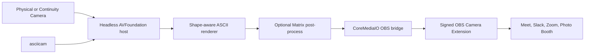

# ASCII Camera

[](https://github.com/yigitsimsek/ascii-camera/actions/workflows/ci.yml)

A headless macOS virtual camera that turns the physical camera feed into
shape-aware ASCII art. Start it from a terminal, then select **OBS Virtual
Camera** in Meet, Slack, Zoom, Photo Booth, or another camera client.

```bash
asciicam
```

The daily workflow has no browser page, OBS process, scene, screen capture,
Dock icon, or manual routing step. The renderer defaults to 240 columns and can
be reconfigured while capture is running. An optional Matrix mode keeps the
same shape-matched glyphs and adds animated green falling trails as a
post-processing effect.

> [!IMPORTANT]
> The free installation uses the signed Camera Extension bundled with OBS
> Studio, but connects to its sink stream through an unofficial compatibility
> bridge. OBS must remain installed, and an OBS update may require a bridge
> update. This project is independent of and not affiliated with OBS Studio.

## Why this project is different

Most ASCII filters map brightness directly to a character ramp. This renderer
models each Menlo glyph as a six-dimensional shape vector, samples both the
inside and neighborhood of every cell, applies directional contrast, and uses
a quantized nearest-glyph cache. Edges and local structure influence glyph
selection instead of brightness alone.

The browser prototype evolved into a native Swift and Objective-C pipeline
using AVFoundation, Core Video, Core Text, CoreMediaIO, launchd, and macOS
system video effects.

## Architecture



See [Architecture](docs/ARCHITECTURE.md) for component boundaries, design
decisions, trust assumptions, and the optional first-party extension path.

## Features

- Shape-aware ASCII matching with a 9^6 glyph lookup cache
- Live Matrix styling that preserves the matched ASCII glyph shapes
- 48–240 columns, adjustable without restarting the camera
- 1920x1080 BGRA virtual-camera output
- Headless per-user LaunchAgent controlled by one CLI
- FaceTime, external, and Continuity Camera discovery
- macOS Portrait, Center Stage, Studio Light, and Background Replacement
- Camera-native output orientation so calling apps mirror self-view once
- No paid Apple Developer membership for the default workflow
- Reproducible core tests, strict bridge compilation, and release benchmarks

## Requirements and compatibility

| Component | Requirement |
| --- | --- |
| macOS | 14 or later; Background Replacement requires macOS 15 or later |
| Hardware | Apple silicon tested; Intel is not currently tested |
| OBS Studio | Must be installed in `/Applications`; 32.1.2 is the tested version |
| Build tools | Apple Command Line Tools with Swift 6 |
| Calling app | Any app that accepts a CoreMediaIO camera device |

The current development machine is a 16 GB M1 Pro MacBook Pro running macOS
26.5.2. Compatibility outside the tested versions is best effort because the
OBS sink is not a supported public integration surface.

## Install

1. Install OBS Studio in `/Applications` from its official distribution.
2. Clone this repository and run:

   ```bash
   scripts/install.sh
   ```

The installer verifies the OBS signature, runs the test suite, builds and
ad-hoc signs the headless host, installs `/Applications/ASCII Camera.app`,
registers a per-user LaunchAgent, and installs `/usr/local/bin/asciicam`.

### One-time Camera Extension activation

If `asciicam status` reports `modern driver: not activated`, run:

```bash
open -a OBS --args --startvirtualcam
```

When the status changes to `approval pending`, open **System Settings → General
→ Login Items & Extensions → Camera Extensions** and enable **OBS Virtual
Camera**. Restart OBS and start its virtual camera once. After it succeeds, quit
OBS completely; daily use does not run it.

Now start ASCII Camera:

```bash
asciicam
```

On first launch, allow **ASCII Camera** to access the physical camera. Fully
quit and reopen calling apps that were running during extension activation so
they refresh their camera lists.

## Commands

```text
asciicam          start the headless camera host
asciicam status   show host, extension, mode, and column state
asciicam mode     show the current render mode
asciicam mode ascii|matrix
                  change render mode live (default: ascii)
asciicam columns  show the current column count
asciicam columns N
                  change columns live (48–240; default 240)
asciicam effects  open Apple's Video Effects panel for ASCII Camera
asciicam stop     release the physical camera
asciicam logs     stream native diagnostics
```

macOS stores video effects per capture application. Run `asciicam effects`
while the host is active to choose a Background specifically for ASCII Camera.

## Performance

Steady-state release measurements on the tested M1 Pro, rendering a 1280x720
source into a 1920x1080 output buffer:

| Columns | Rows | ASCII median | Matrix median |
| ---: | ---: | ---: | ---: |
| 48 | 16 | 2.7 ms | 8.6 ms |
| 96 | 31 | 5.8 ms | 12.8 ms |
| 120 | 39 | 7.6 ms | 14.1 ms |
| 180 | 59 | 15.6 ms | 21.7 ms |
| 240 | 78 | 20.8 ms | 27.7 ms |

These are renderer-only medians over three measured frames after one warmup;
they are not end-to-end latency claims. Matrix adds an in-place color pass
after the same ASCII frame is finished. Reproduce measurements for both modes
locally with:

```bash
scripts/benchmark.sh
```

## Development

Run the renderer tests, release host build, and strict Objective-C bridge check:

```bash
scripts/test.sh
```

The repository is organized by runtime responsibility:

```text
Sources/AsciiCameraCore/             renderer and shared frame primitives
Native/Host/                         active headless macOS host
Native/OBSBridge/                    isolated OBS Camera Extension bridge
Tests/                               renderer and frame-store tests
Benchmarks/                          release renderer benchmark
Experimental/FirstPartyCameraExtension/
                                     paid-team first-party extension path
Prototype/Browser/                   original HTML/JavaScript prototype
```

## First-party Camera Extension experiment

The Xcode project under `Experimental/FirstPartyCameraExtension` implements the
supported long-term architecture: ASCII Camera owns its Camera Extension and
does not depend on OBS. Apple does not provision the required System Extension
capability for free Personal Teams. With a paid Apple Developer team and full
Xcode installed, build it with:

```bash
scripts/install-first-party-extension.sh PAID_APPLE_DEVELOPER_TEAM_ID
```

## Browser prototype

The original implementation is preserved for comparison:

```bash
cd Prototype/Browser
npm install
npm start
```

## Troubleshooting and uninstall

See [Troubleshooting](docs/TROUBLESHOOTING.md) for extension approval, camera
permissions, stale shell aliases, video effects, and performance. Remove the
local installation without touching OBS by running `scripts/uninstall.sh`.

## Acknowledgements

The shape-aware renderer is based on concepts described by Alex Harri in
[“ASCII characters are not pixels: a deep dive into ASCII
rendering”](https://alexharri.com/blog/ascii-rendering), including
six-dimensional glyph vectors, staggered sampling regions, directional
contrast enhancement, and quantized glyph lookup. This project adapts those
ideas into an independent Swift/CoreVideo implementation for live
virtual-camera frames.

## License

[MIT](LICENSE). OBS Studio is a separate dependency distributed under its own
license.
