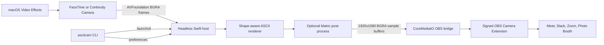

# Architecture

ASCII Camera is split into a platform-independent renderer, a headless macOS
capture host, a narrow CoreMediaIO bridge, and a shell CLI.

## Components

- `Sources/AsciiCameraCore` contains the renderer and shared frame primitives.
  It has no dependency on OBS.
- `Native/Host` captures the selected physical camera, applies system video
  effects upstream, renders frames, and runs without a Dock icon or window.
- `Native/OBSBridge` discovers the OBS Camera Extension's sink stream through
  CoreMediaIO and enqueues sample buffers. It does not launch or link against
  the OBS application.
- `bin/asciicam` controls the per-user LaunchAgent and stores live settings in
  the app's preferences domain.
- `Experimental/FirstPartyCameraExtension` is the clean, supported long-term
  architecture, but provisioning it requires a paid Apple Developer team.
- `Prototype/Browser` preserves the original HTML/JavaScript renderer.

## Renderer

This is not a luminance-to-character ramp. Each Menlo glyph is represented by
a six-dimensional shape vector. For every output cell, the renderer samples
six staggered internal regions and ten neighboring regions, applies directional
and global contrast, quantizes the vector, and looks up the nearest glyph in a
9^6 cache. Changing the column count rebuilds the sampling grid without
restarting capture.

Matrix mode does not replace or bypass this process. The renderer first draws
the complete white-on-black ASCII frame through the same matching and Core Text
path. A subsequent in-place color multiplication tints only those existing
glyph pixels. Per-cell source luminance creates emerald-to-mint tonal depth,
local luminance gradients lift contours, and time-based trails add restrained
motion. Portrait mode activates rain on a sparse deterministic subset of
columns, allowing stronger moving highlights without overpowering the subject.
Black background pixels remain black, and switching back to ASCII requires no
renderer rebuild. The native color pass skips exact-black background pixels,
avoiding color arithmetic for most of the 1920x1080 output surface.

The `matrix-old` compatibility mode uses the same post-processing boundary and
stream timing with the earlier uniform green palette. It exists only for live
visual comparison; both Matrix modes consume the identical matched glyph frame.

## Key decisions

### Reuse the signed OBS Camera Extension

Apple does not provision the System Extension capability for free Personal
Teams. The default workflow therefore treats an installed OBS Camera Extension
as the signed camera-device carrier and writes directly to its sink stream.
This keeps OBS closed during daily use and avoids screen capture.

This integration is intentionally isolated behind `Native/OBSBridge`. It is
not an OBS-supported public API and may break when OBS changes its extension.
The first-party extension experiment documents the migration path.

### Apply system effects before ASCII rendering

AVFoundation capture lets macOS Portrait, Center Stage, Studio Light, and
Background Replacement affect the physical camera before the renderer samples
the image. Effects are stored per capture application, so ASCII Camera exposes
`asciicam effects` to open the correct system panel.

### Publish camera-native orientation

Calling apps normally mirror only the local self-view. Publishing native
orientation prevents a double mirror while keeping the remote feed conventional.

### Fixed transport format

The OBS bridge publishes 1920x1080 BGRA frames at a 30 fps timeline. Rendering
cadence is allowed to fall below the transport cadence at high column counts;
the most recent completed frame remains available to consumers.

## Trust boundaries and compatibility

- Camera pixels stay on the Mac and are not sent over the network by this code.
- OBS remains a separately installed and separately licensed dependency.
- The bridge currently identifies the OBS virtual camera by its stable device
  UUID and expected sink-stream layout. Both are compatibility assumptions.
- The app is ad-hoc signed for local installation. macOS camera permission is
  attached to that local app identity.
